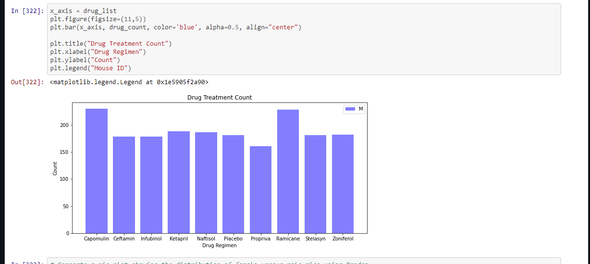
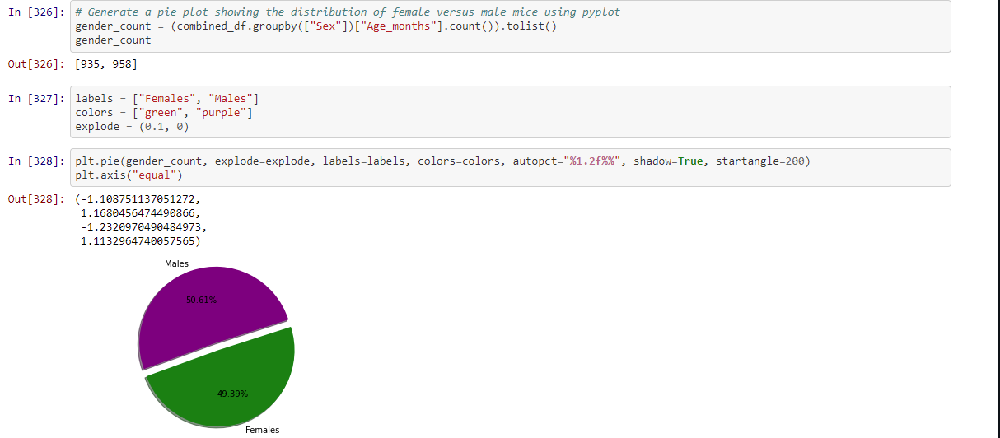
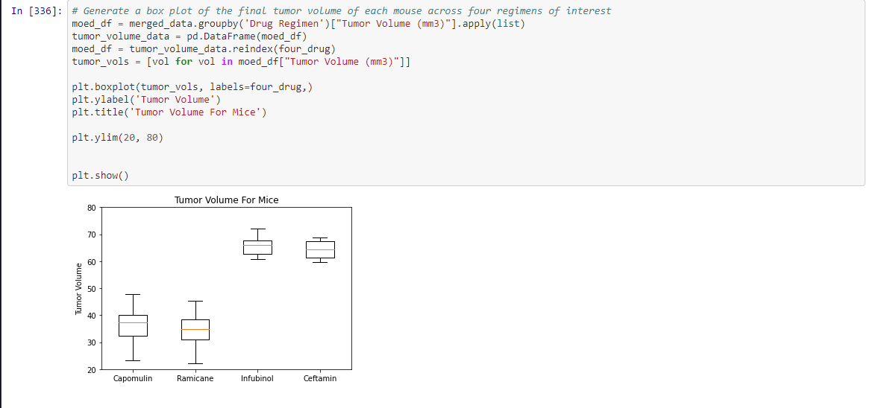
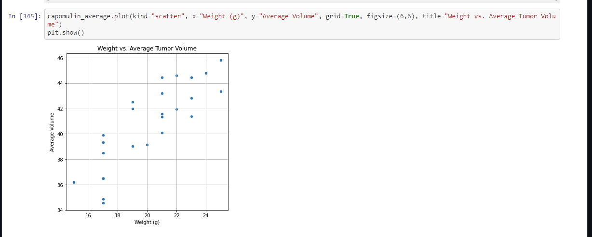
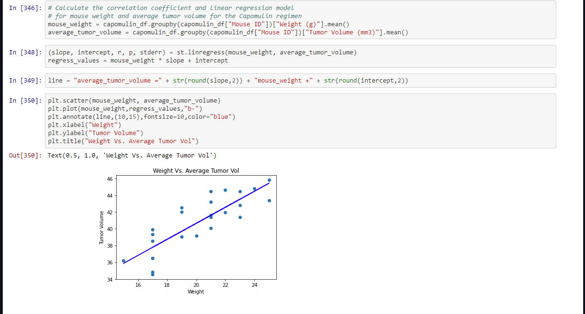

# mouse_tumor

Tools: Jupyter Notebook

Purpose: 
Analyze drug and mice tumor data
Plot the data in different ways (bar, scatter, boxplot, line)
Create 3 small observation of the results from the code

1. Import and read Mouse_metadata.csv and Study_results.csv
2. Combine the data using Inner join on Mouse ID
3. Check new combined df and drop duplicates
4. Created an output that shows the drug used and their mean, median, variance, standard deviation, and SEM using groupby function
5. Created an output that shows the drug used and their mean, median, variance, standard deviation, and SEM using aggregate function
6. Created a bar chart that looked at Mouse ID and Drug Regiment

8. Created a pie chart showing male to female mice ratio

9. Create code to print out quartile and median of Tumor Volume along with values below and above outlier
10. Created a boxplot using Tumor Volume and Drug Regimen 

11. Created a line plot using Timepoin and Tumor Volume 

12. Created a scatter plot to shopw weight vs average tumor volume

13. Made a code to calculate correlation coefficient and linear regression model

