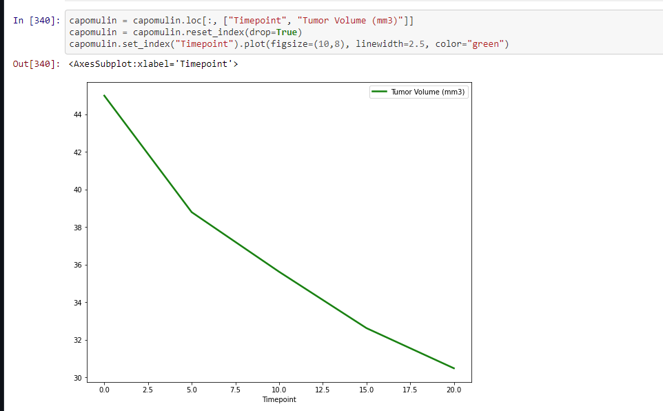

# mouse_tumor

Tools: Jupyter Notebook

Data is relatively messy and that is why it's important to clean it up and present it in a way that is understandable. This is true in the world of business but it is also as important in the world of science. Where not only correct data but the correct way of showing data will help in better understanding research and help researchers get their point across. 

Purpose: 
    
    - Analyze drug and mice tumor data
    
    - Plot the data in different ways (bar, scatter, boxplot, line)
    
    - Create 3 small observations of the results from the code

1. Import and read Mouse_metadata.csv and Study_results.csv
2. Combine the data using Inner join on Mouse ID
3. Check new combined pd function and drop duplicates
4. Created an output that shows the drug used and their mean, median, variance, standard deviation, and SEM using group by function
5. Created an output that shows the drug used and their mean, median, variance, standard deviation, and SEM using an aggregate function
6. Created a bar chart that looked at Mouse ID and Drug Regiment

8. Created a pie chart showing male to female mice ratio

9. Create code to print out the quartile and median of Tumor Volume along with values below and above the outlier
10. Created a boxplot using Tumor Volume and Drug Regimen 

11. Created a line plot using Timepoin and Tumor Volume 

12. Created a scatter plot to show weight vs average tumor volume

13. Made a code to calculate the correlation coefficient and linear regression model

